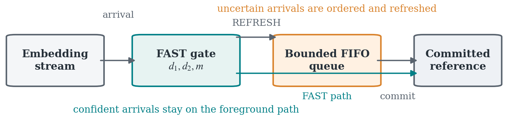
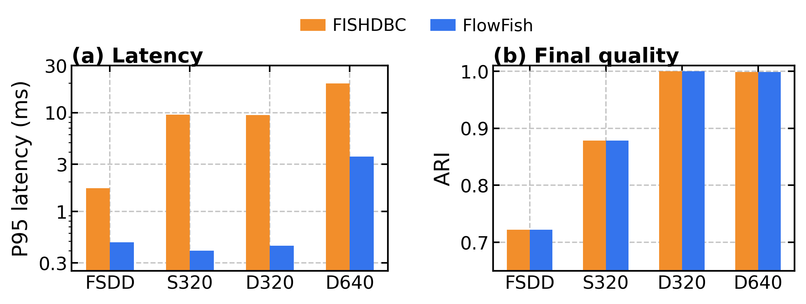
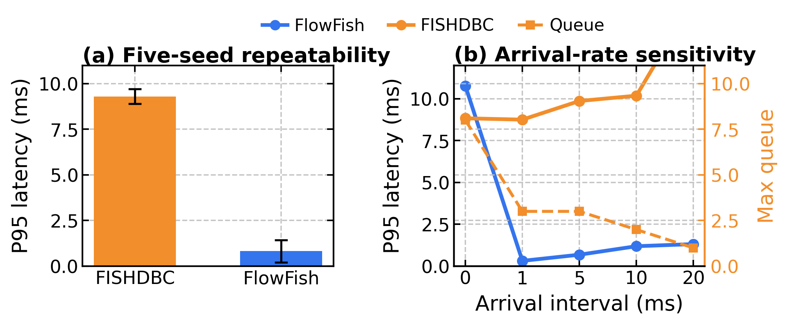

# FlowFish: Reproducible Streaming Clustering

This directory contains the code, data contracts, selected figures, and
recorded evidence for the ICASSP 2027 study of **FlowFish**, a
selective-maintenance policy for streaming density clustering.

FlowFish separates latency-critical labeling from density maintenance:

- confident arrivals use a nearest-representative distance-margin gate;
- uncertain arrivals enter an ordered, bounded FIFO refresh path;
- a background FISHDBC worker maintains the committed density reference;
- queue depth, backpressure, maintenance time, and recomputation count are
  recorded instead of hidden.

The implementation key is `adaptive_fishdbc_async`. The paper name and code
name are intentionally documented together so that results can be traced from
the manuscript to the benchmark driver.

## What Is Reproduced

| Evidence | Entry point | Output |
| --- | --- | --- |
| Synthetic smoke | `scripts/run_synthetic_smoke.sh` | `results/smoke_latest/` |
| Async comparison | `scripts/run_async_validation.sh` | `results/async_validation/` |
| Arrival-rate boundary | `scripts/run_rate_sweep.py` | `results/rate_sweep_release/` |
| Multi-seed robustness | `scripts/run_multiseed_validation.py` | `results/multiseed_release/` |
| Release bundle | `scripts/reproduce_paper.sh release` | all four `*_release/` directories |
| Paper-scale rerun | `scripts/run_final_rerun.sh` | `results/final_rerun_release/` |
| Figure generation | `scripts/generate_formal_icaspp_figures.py` | a user-selected figure directory |
| Dataset download | `scripts/download_fsdd.sh` | `data/fsdd/raw/` |

The committed `results/` tree contains the portable release evidence intended
for reproduction. Exploratory records and operational notes are kept outside
the public research package.

## Quick Start

From this directory, the complete release reproduction is:

```bash
bash scripts/reproduce_paper.sh all
```

The dispatcher also exposes `setup`, `data`, `audio`, `baseline`, `smoke`,
`release`, and `main` modes. `data` downloads the pinned FSDD archive, verifies
its checksum and 3000 WAV files, and writes the local provenance record. The
release benchmark uses committed embedding fixtures and therefore does not
require raw audio.

To run the main asynchronous comparison:

```bash
bash scripts/run_async_validation.sh
```

To sweep arrival intervals on the synthetic stream:

```bash
.venv/bin/python scripts/run_rate_sweep.py \
  --data data/synthetic_320.npz \
  --out results/rate_sweep_release
```

To run the paper's multi-seed protocol:

```bash
.venv/bin/python scripts/run_multiseed_validation.py \
  --out results/multiseed_release \
  --seeds 20260910 20260911 20260912 20260913 20260914
```

To regenerate the complete lightweight release bundle in one command:

```bash
bash scripts/reproduce_paper.sh release
```

The longer main-table rerun is:

```bash
bash scripts/reproduce_paper.sh main
```

It uses the committed FSDD embedding fixtures. See
[`data/fsdd/PROVENANCE.md`](data/fsdd/PROVENANCE.md) for the pinned upstream
source, license, checksum, and deterministic subset description.

To regenerate the real-audio input from the pinned FSDD archive, provide a
local ONNX speaker-embedding model whose first input accepts 80-bin FBank
features:

```bash
bash scripts/reproduce_paper.sh data
FSDD_MODEL=/path/to/speaker_embedding.onnx bash scripts/run_audio_smoke.sh
```

The audio path is split into three explicit steps:
`prepare_fsdd_audio.py` creates the seeded speaker-balanced manifest,
`audio_to_embeddings.py` converts the manifest to the common `X`/`y` NPZ
contract, and `run_audio_smoke.sh` executes the clustering comparison. The
model file is an external input and is never copied into this repository. For
a fixture-only baseline, run:

```bash
bash scripts/run_full_baseline.sh
```

## Method and Metrics

`scripts/run_benchmark.py` uses the same normalized embedding stream and labels
for every method. The primary comparison includes:

- `full_hdbscan`: full-prefix HDBSCAN reference;
- `fishdbc`: incremental FISHDBC baseline;
- `adaptive_fishdbc_async`: FlowFish;
- `ahc`, `sc_pna`, and `diart_style`: comparison controls.

The benchmark reports ACC with noise as singleton, ARI, NMI, false-merge rate,
coverage, foreground mean/P95 latency, wall time, peak RSS, recomputation
count, maintenance time, maximum queue depth, and backpressure.

The FSDD metric `cluster_accuracy_noise_singletons` treats noise points as
singletons. It must be read together with ARI, NMI, false-merge rate, and
coverage. A single accuracy number is not treated as sufficient evidence for a
streaming speaker-clustering claim.

## Release Results

The headline release measurements are summarized in
[`RESULTS.md`](RESULTS.md). The paired async bundle reports both foreground
latency and deferred-maintenance counters. On the current release run,
FlowFish reaches `0.207 ms` P95 on the 30-point FSDD stream and `1.567 ms`
P95 on the 320-point synthetic stream, compared with `1.422 ms` and
`8.383 ms` for FISHDBC. The same table reports ARI, recomputation count, and
maximum queue depth so that the latency claim is not separated from quality or
overload behavior.

## Figures

The selected release figures are kept in [`figures/`](figures/):







The PNG files are provided for GitHub rendering. The PDF framework figure and
the plotting scripts preserve publication-quality assets for the paper build.

## Script Index

| Script | Role |
| --- | --- |
| `scripts/reproduce_paper.sh` | unified setup, data, smoke, release, and main dispatcher |
| `scripts/download_fsdd.sh` | pinned FSDD download, checksum, extraction, and provenance |
| `scripts/prepare_fsdd_audio.py` | deterministic balanced audio manifest |
| `scripts/audio_to_embeddings.py` | standalone ONNX audio-to-embedding conversion |
| `scripts/run_audio_smoke.sh` | real-audio embedding and clustering smoke |
| `scripts/run_full_baseline.sh` | fixture-only Full HDBSCAN baseline |
| `scripts/run_benchmark.py` | common benchmark driver and metrics |
| `scripts/run_async_validation.sh` | paired FlowFish/FISHDBC comparison |
| `scripts/run_rate_sweep.py` | arrival-rate sensitivity |
| `scripts/run_multiseed_validation.py` | five-seed robustness |
| `scripts/run_final_rerun.sh` | L/M/H paper-scale rerun |
| `scripts/generate_formal_icaspp_figures.py` | publication-style figure generation |

Fresh server-side release checks are stored separately from the historical
evidence:

- `results/smoke_release/`: server-checked core synthetic smoke with the
  default controls;
- `results/async_validation_release/`: paired FSDD and synthetic async runs;
- `results/rate_sweep_release/`: four arrival intervals for FlowFish and
  FISHDBC;
- `results/multiseed_release/`: five paired synthetic seeds.

## Repository Layout

```text
data/       committed synthetic fixtures and derived embedding fixtures
figures/    selected paper figures for repository inspection
results/    release summaries, traces, and tables
scripts/    benchmark, validation, plotting, and release checks
vendor/     third-party source required by the FISHDBC and fast-HDBSCAN controls
RiskAware.lean
```

Contribution and maintenance rules are documented in
[`CONTRIBUTING.md`](CONTRIBUTING.md).

## License

The original source code in this repository is released under the MIT License.
See [`../../LICENSE`](../../LICENSE). FSDD-derived artifacts and vendored
comparison backends retain separate terms documented in
[`THIRD_PARTY_NOTICES.md`](THIRD_PARTY_NOTICES.md).

## Scope and Limitations

The formal statements in `RiskAware.lean` are conditional. They do not prove
that representative assignment is universally equivalent to HDBSCAN, nor do
they replace empirical calibration. The benchmark therefore reports both
quality and operational boundary metrics, including overload behavior.

The included FSDD embedding fixtures exercise the complete data contract but
should not be interpreted as a claim about cross-domain speaker-recognition
quality. The embedding model and the FSDD recordings have different domains.

## Citation

If you use the FlowFish code or results, cite the accompanying ICASSP 2027
paper and the upstream FISHDBC work. A machine-readable software citation is
provided in [`CITATION.cff`](CITATION.cff). The manuscript source is
maintained outside this repository.
